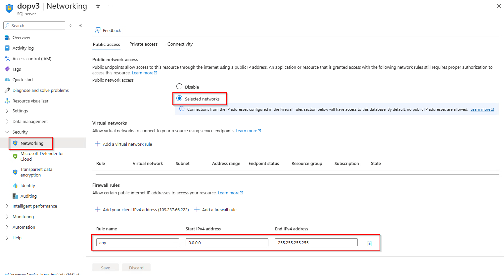

# Mock project step by step

1. Create & Config Azure SQL Database:
+ Create SQL server name "dopv3":
  
+ Create database name "products" and insert 5 record:
  
+ Config SQL server network, enable public access:
  

2. Create Spring Boot app & connect to SQL DB & push to github repo:
+ Get DB connection string:
  
+ Config application.properties in Spring Boot app:
  
+ Push source code to github repo:
  

3. Create Azure DevOps project & Service connection & create pipeline map to github repo:
+ DevOps project name: group_project01
+ Service connection name: dopham-sc
+ Pipeline:
  

4. Tạo pipeline:
+ Gồm 2 stages: Build và Deploy
+ Build:
  + Checkout code
  + Build with maven
  + publish artifact (output from maven build)
+ Deploy stage:
  + download artifact
  + config environment variable for app service
  + deploy jar file(artifact) to app service